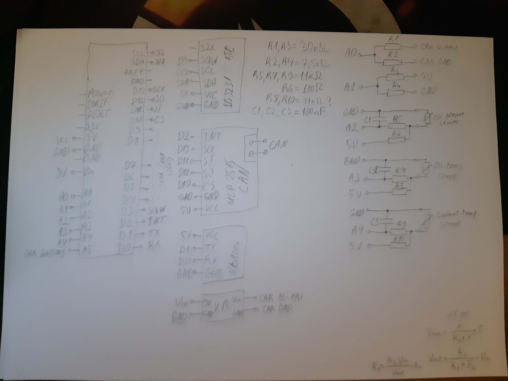

# Car FIS Display
Custom car FIS display with sensors on arduino

## Features
* Same Warning lights as stock
* Sensors
* Clock

## Warning Lights
todo

## Sensors
todo

## Clock
todo

## Pictures

Stock instrument cluster warning lights

 

Testing phase

New dash warnings

New dash cold

New dash hot

Scematic

cluster back

Arduino add board

##todo
