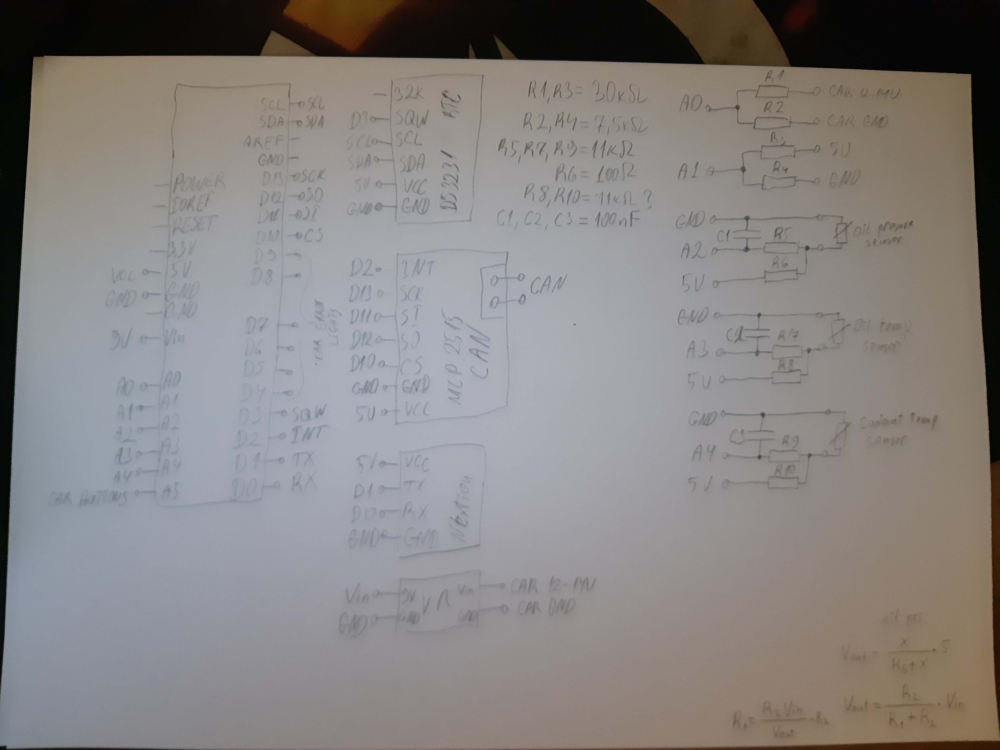

# Car FIS Display
Custom car FIS display with sensors on arduino

## Features
* Same Warning lights as stock
* Sensors
* Clock

## Warning Lights
todo

## Sensors
todo

## Clock
todo

## Pictures

Stock instrument cluster warning lights

The stock cluster of the mk4 golf i have, has only 6 warning lights at the center, and that is a perfect spot for adding stuff.

 

New instrument cluster warning lights

I wanted to keep the factory layout of the warning lights for the time being so i left that part of the display reserved only for them. But in the future that can change.

 

The new instrument cluster with the car working and warmed up.

The testing phase and schematic.

Here the sensors are being calibrated on a small Arduino pro micro. Later switched to Arduino Mega for the finished project.

 

The backside of the instrument cluster and a board with all the connections for the arduino, made as a custom shield.
The warning lights have constant 12v through them and the connection to the ground is controlled by the ECU. So I had to add a small board with a resistor and photocoupler for each of the 6 leds.

 
